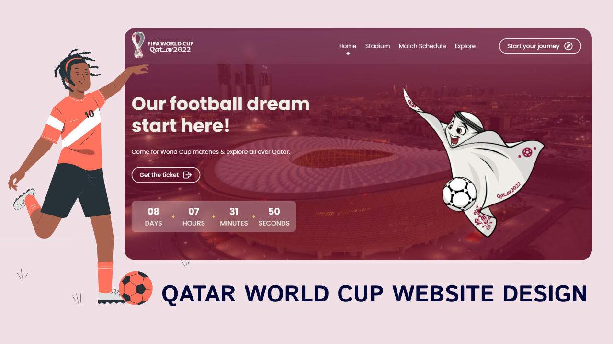

# QATAR World Cup Website  

## Introduction:

The FIFA World Cup 2022™ in Qatar is the first to be hosted in the Middle East and the most geographically compact since the inaugural edition of the tournament in 1930 

The FIFA World Cup™ is the biggest single-sport competition in the world. After a preliminary competition, the 32 qualified men’s national football teams compete to become world champions in a final competition staged during one month in a host country selected by FIFA.
 

### Unique characteristics of the tournament

A key objective of the FIFA World Cup 2022™ is that it serves as a catalyst for the achievement of Qatar’s long-term development goals as laid out in the Qatar National Vision 2030 and the National Development Strategy 2018-2022.

### STADIUM LOCATIONS

## Sustainability impacts of the tournament

Hosting the tournament presents tremendous opportunities for development of local industries, expertise and infrastructure, for innovation and application of world-class standards, and for support of Qatar’s transition to a knowledge-based economy. As with any mega-event, the FIFA World Cup 2022™ also presents risks related to the increased use of limited natural resources and the generation of emissions, as well as to the health, safety and well-being of all people involved in the tournament, including workers, participants, attendees and local communities. 

### [🔗Live Demo](https://qatar-world-cup.codsfli.com/)

## Output Of my Website :

---

